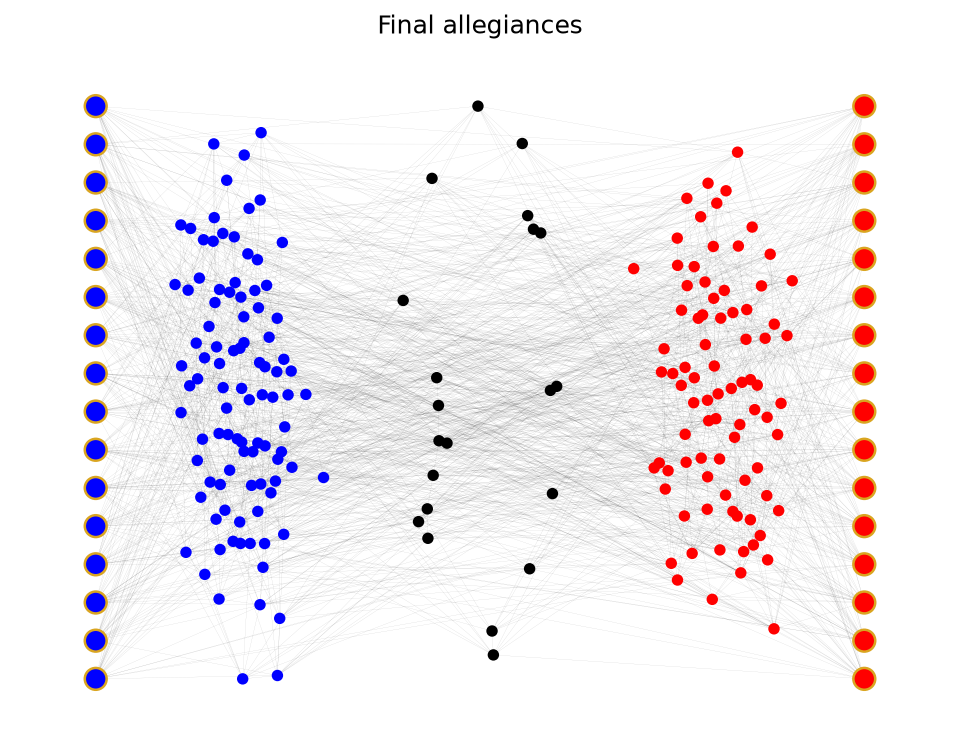

# Polarised Perspectives

**Modelling opposing political WhatsApp forwards as competing contagions on a social network.**

Come election season, Indian WhatsApp users should expect a flood of political "forwards": chain messages started by political parties to entice voters. This project models two such rival campaigns, left and right, spreading at the same time through a network of neutral citizens, and explores what makes one campaign beat the other, and under what conditions a population ends up fully polarised.

Course project for **MATH231 Modeling for Social Sciences (2024)** at **FLAME University, Pune**, taught by **Professor Santosh Kudtarkar**. 
Full project report included and available at [report/report.md](report/report.md).

## How it works



A population of `N` citizens is connected in a random regular graph, with each citizen knowing `D` others. On top of these, a special type of agent is added to the network: influencers, who hold fixed allegiance to one side, `IL` of them on the left and `IR` on the right, each connected to `DL` or `DR` random citizens. Persuasion operates on a linear scale, where negative persuasion represents the left and positive persuasion the right.

At the zeroth time step, every influencer broadcasts their campaign to all their connections, shifting each receiver's net persuasion by the campaign's persuasiveness score (`PL` or `PR`). Each citizen also has a personal susceptibility threshold, sampled from a normal distribution with mean `SM` and standard deviation `SD`, which tells how much persuasion they need before aligning with a side. A citizen whose net persuasion crosses their threshold joins that side and broadcasts the campaign once to their own connections, so a message keeps spreading only through newly convinced followers. It is also possible for a convinced citizen to receive enough opposing persuasion to turn neutral again (a mood change), and perhaps even join the other side. The simulation continues until the allegiances of every citizen stabilise.

| Parameter | Description | Default |
|-----------|-------------|--------:|
| `N`  | Number of citizens | 200 |
| `D`  | Connections per citizen | 9 |
| `IL` / `IR` | Influencers on the left / right | 16 / 16 |
| `DL` / `DR` | Connections per left / right influencer | 23 / 23 |
| `PL` / `PR` | Persuasiveness of the left / right campaign | −8 / +8 |
| `SM` | Mean susceptibility | 9 |
| `SD` | Susceptibility standard deviation | 3 |

The defaults are the tuned parameter set found by the project's Optuna study: the conditions under which two equally matched campaigns most completely and evenly divide the population.

## Setup

Requires Python 3.11+. Clone the repo, create a fresh virtual environment, and install the pinned dependencies:

```
git clone https://github.com/madhav-gupta-ai/polarised-perspectives.git
cd polarised-perspectives
python -m venv .venv
.venv\Scripts\activate        # Windows  (macOS/Linux: source .venv/bin/activate)
pip install -r requirements.txt
```

## Usage

Run a simulation (prints per-step counts and the final split):

```
python -m src.simulate
python -m src.simulate --pr 9.6 --seed 7          # give the right campaign an edge
python -m src.simulate --plot network.png          # save the clustered network view
```

With the default seed:

```
step 1: left=52 right=58 neutral=90
...
step 13: left=96 right=83 neutral=21
Convergence reached at iteration 13
Final allegiances: left=96 right=83 neutral=21 (mood changes: 80)
```

Search for the most polarising conditions (Optuna Bayesian optimisation, both sides get identical parameters):

```
python -m src.tune --trials 500
```

Every flag has a default and `--help` documents them all; `--seed` makes any run exactly reproducible.

## Notebooks

Both notebooks are committed fully executed, so all their figures can be viewed directly on GitHub.

- [notebooks/01_simulation_scenarios.ipynb](notebooks/01_simulation_scenarios.ipynb) runs the baseline simulation, with before and after views of the network (citizens clustered by their final allegiance), followed by the campaign experiments, where one parameter of the right side's campaign is raised by 20% at a time.
- [notebooks/02_parameter_tuning.ipynb](notebooks/02_parameter_tuning.ipynb) contains the 500-trial Optuna study, with the optimisation history, parameter importances, slice plots, pairplot and correlation matrix across the trials.

To re-run them yourself, `pip install jupyter` and open the notebooks from the repo root.

## Results

Starting from an even contest between the two campaigns (82–77, with 41 citizens neutral), raising a single parameter of one side's campaign by 20% is enough to flip the outcome entirely. The results compound since every newly convinced citizen re-broadcasts the campaign to their own contacts. Raising the persuasiveness of the message converts the entire population (200–0) in just 8 time steps, and raising the number of influencers does the same in 12, while raising the popularity of the influencers wins a strong majority (163 against 13) but fails to convert everyone. Just as the correlation matrix in the report suggested, the persuasiveness of the campaign is the single most important factor: a more convincing forward beats having more, or more popular, messengers.

## Disclaimer on responsible use

This model simulates how political messaging campaigns spread through and polarise a population. It was built for academic study, to understand how such campaigns work and how they might be countered, not to help run one. Do not use this project to plan, optimise or operate an actual influence campaign.

## License

[MIT](LICENSE) © 2024 Madhav Gupta
