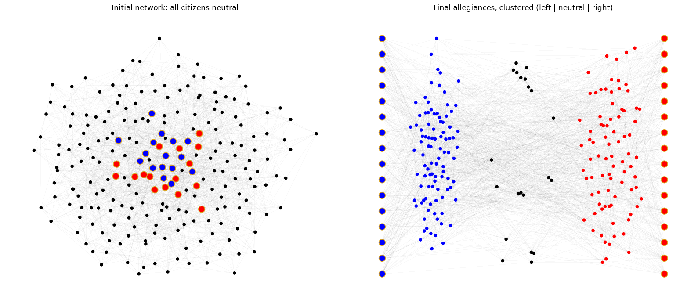
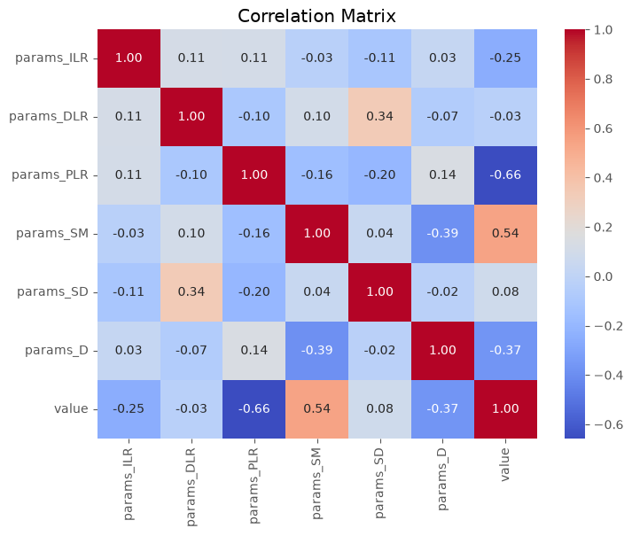
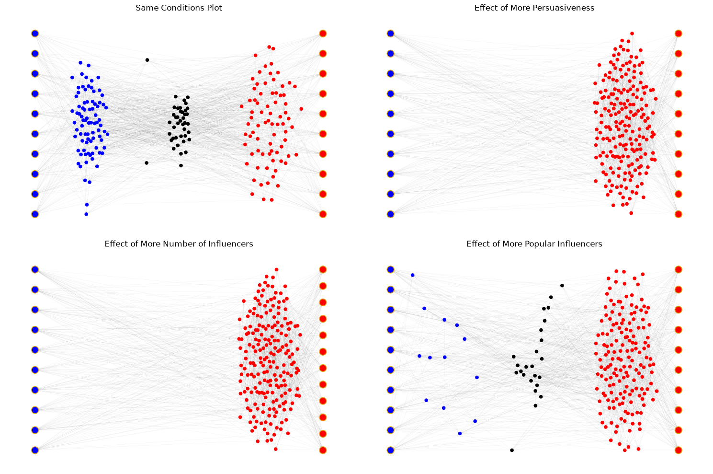
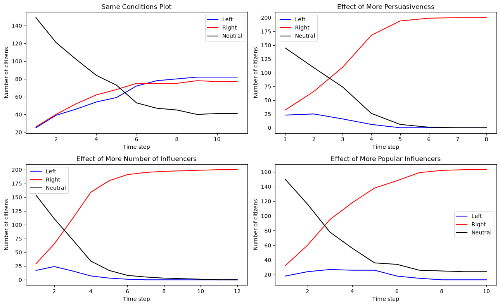

<div align="center">

# Polarised Perspectives: Modelling Opposing Political WhatsApp Forwards

### Madhav Gupta

**MATH231 · Modelling for Social Sciences · 2024**

FLAME University, Pune, India

*Taught by Professor Santosh Kudtarkar*

</div>

## Introduction

The title of *'World's Largest Democracy'* does not come without its challenges. This past decade has witnessed India's rise from a third-world developing country to an up-and-coming global superpower, intersecting with an era noted by the pinnacle of human technology being available at your fingertips. Long gone are the days when the smartphone was still a foreign object to the masses – today, our online culture may be as much a part of our daily lives as the real world. Thus, it is no surprise that the ever-innovating market of 'virtual' possibilities has by now managed to pervade into all sorts of 'real' matters, and hold a significant and a majoritarian influence in people's thinking – for better or worse. In this paper, we are going to look at one such tool of influence that, with evidence from the past, manages to affect perhaps one of the most crucial and important decisions made by the people of a country.

With the seasonal extremity of fake news approaching once again alongside this election season, Indian citizens should expect to receive a lot more *'WhatsApp forwards'*. Although coming off as spam at first look, the Meta-owned messaging giant *WhatsApp* is India's favourite and most popular messaging app [[1]](#ref-1). With a 97.1% market penetration, the widespread use of WhatsApp in India cannot be understated, and there are little to no population segments that do not actively use this app [[2]](#ref-2). However, the massive and abundant size of its userbase has also, especially in the past decade, made it a target for propaganda and influence when it needs to be spread to a large population base as quickly as possible. Appearing as *'WhatsApp forwards'*, such chain messages (often accusatory, misinforming, influential and galvanising in nature) are started by political parties to entice the people into favouring them over the opponents. Come election season, these guerrilla tactics are expected to have worked their charm and rattled the population base enough to make crucial differences in the outcomes (such as *swing states*) [[3]](#ref-3).

Not only do these campaigns (which are interestingly prominently pro-BJP) hurt the integrity of an electoral democracy [[4]](#ref-4), they also radicalise the more susceptible and vulnerable targets in the population, they also purport and propagate a wide range of *fake news* and misinformation [[5]](#ref-5). In this paper, we are going to model and simulate competing WhatsApp campaigns of two opposing political parties, which broadcast their campaigns to a network of neutral individuals in an opinion dynamics context. We are going to explore the effects of different campaign decisions on a neutral population, the effects of social influence in a network, the validity of the threshold theory, and exactly what goes into making the viral campaigns that we so often witness. We will jump into our implementation approach and the associated model/algorithm in the [Model](#model) section. The results will be observed, analysed and discussed in the [Discussion](#discussion) section. Lastly, we conclude our paper and refer to future work and scope in the [Conclusion](#conclusion).

## Model

In order to track the effects of social influence of a campaign on a population of neutral citizens, we use an agent-based network, and model the two rival campaigns in an opinion dynamics context. We assume two political campaigns: *left* and *right*. A population of neutral citizens modelling WhatsApp contacts and connections is represented as a random graph network, with each node being connected to a given number of random nodes. Furthermore, a special type of nodes is added to the network – *Influencers*. Influencers have fixed allegiance to either the left or the right side, and are connected to a higher number of nodes than the average citizens. These influencers represent the propagandists who start the WhatsApp campaign by broadcasting it to a large number of citizens. Each of the two campaigns has a *persuasiveness* score, which speaks to how convincing the campaign is. We assume that *persuasion* operates on a linear scale, where positive persuasion represents right-leaning while negative persuasion represents left-leaning.

Each individual is unique, as some are more suggestible than others. Thus, the *susceptibility* attribute for an individual, sampled from a specified normal distribution, tells how much persuasion an individual needs to align with one of the two sides. At the zeroth time step, every influencer broadcasts their team's campaign to all their connections. An individual is *convinced* only if their net persuasion (combining the campaigns from both the left and the right side) is higher than their susceptibility threshold. If *convinced* to be on a particular side, the individual broadcasts their team's campaigns to all of their connections. Note that after being convinced, an individual broadcasts their campaign only once. It is also possible for a convinced individual to receive more persuasion from the opposing side, which might make them turn neutral, and then perhaps even join the opposing side. The model continues until an equilibrium is reached i.e. no more broadcasts are being made, and the allegiances of each individual is finalised in our system.

The following parameters are specified for the model:

| Parameter | Description |
|:---------:|-------------|
| `N`  | Number of Regular Agents (Citizens) |
| `D`  | Degree of Connections of Regular Agents (how many other citizens known) |
| `IL` | Number of Influencers on the Left Side |
| `IR` | Number of Influencers on the Right Side |
| `DL` | Degree of Connections/Influence of each Influencer on the Left Side |
| `DR` | Degree of Connections/Influence of each Influencer on the Right Side |
| `PL` | Persuasiveness Score of the Left Side's Campaign (−ve value) |
| `PR` | Persuasiveness Score of the Right Side's Campaign (+ve value) |
| `SM` | Mean Susceptibility of Citizens |
| `SD` | Standard Deviation in Susceptibility of Citizens |

The algorithm of the model is as follows:

```text
At time step t = 0:
    Persuasion of each Citizen is set to 0
    Susceptibility of each Citizen is sampled from the specified Normal Distribution

    Left Influencers broadcast the Left Campaign:
        for each Influencer in IL, for each connected Citizen:
            Persuasion of the Citizen = Persuasion - PL

    Right Influencers broadcast the Right Campaign:
        for each Influencer in IR, for each connected Citizen:
            Persuasion of the Citizen = Persuasion + PR

At any given time step t:
    for each Citizen, check for changes in Net Persuasion from the previous time step:

        if now Persuasion >= Susceptibility, but it was not in the previous time step:
            Citizen joins the Right Side
            Citizen broadcasts the Right Side message to all their connections:
                for each connected Citizen:
                    Persuasion of the connection = Persuasion + PR

        if now Persuasion <= (-Susceptibility), but it was not in the previous time step:
            Citizen joins the Left Side
            Citizen broadcasts the Left Side message to all their connections:
                for each connected Citizen:
                    Persuasion of the connection = Persuasion - PL

        if now Persuasion is within (-Susceptibility, Susceptibility):
            Citizen becomes/stays Neutral

        else:
            do nothing
```

The algorithm above assumes that persuasion is not solely related to the campaign's persuasiveness, but also social influence. Citizens look at *who* is sending the campaign, and are thus immune to repeated campaign broadcasts from the same individual. A campaign broadcast is repeated only if it is propagated by a newly converted follower, which is what citizens look for. The model above is implemented in Python using the library *NetworkX*. The code is available in the [`src/`](../src) directory of this repository.

## Discussion

Simulating the model, due to the random nature of the graph, can still lead to unexpected results, and is thus only useful when multiple trials are conducted and the most common observations are taken. Using the hyperparameter tuning library *Optuna*, we use Bayesian optimisation over various candidate sets of parameters to find one such set of parameters which minimises the number of neutral individuals and seeks to divide the non-neutral individuals among the two parties as evenly as possible. Since we want bipartite results, we choose the same values of parameters for the two sides. One such possible combination that we obtain is as follows:

```text
Best parameters: {'ILR': 16, 'DLR': 23, 'PLR': 7.99, 'SM': 8.91, 'SD': 3.18, 'D': 9}
Best objective value: 649.0
```

Based on the above results, for a population of 200 citizens, the most even non-neutral party distributions are obtained when each citizen's degree of connections is 9, each party has 16 influencers with degree 23 each, the persuasiveness of the campaign is around 8, and the susceptibility follows a normal distribution with a mean of approximately 9 and a standard deviation of approximately 3. Simulating the model for such parameters gives us one trial that converges after 13 time steps, with 96 citizens on the left, 83 on the right, and 21 neutral. The networks of this time step can be represented as graphs:

<p align="center">
  
</p>
<p align="center"><em>The network before the campaigns begin (left) and at convergence, clustered by final allegiance (right). Gold-ringed nodes are influencers.</em></p>

The correlation matrix obtained through tuning is as follows:

<p align="center">
  
</p>

In the matrix above, *value* is a measure of the entropy in the system discounting neutrality i.e. how polarised the population is. We can notably observe that entropy is significantly inversely proportional to the persuasiveness of a campaign message, whereas susceptibility is directly proportional to it. Thus, we can infer that the more easily influenced people are by the campaign, the more majoritarian a party can become. This is further corroborated by the inverse relations with the number of Influencers, the Degree of Connectedness of citizens (more people to talk to means more people to influence/be influenced by) etc.

For our trials, we will take a toy set of parameters:

| `N` | `D` | `IL` | `IR` | `DL` | `DR` | `PL` | `PR` | `SM` | `SD` |
|:---:|:---:|:----:|:----:|:----:|:----:|:----:|:----:|:----:|:----:|
| 200 | 10  | 10   | 10   | 25   | 25   | −5   | +5   | 10   | 3    |

This parameter set generally gives us even distributions, which can be visualised as follows:

<p align="center">
  
</p>
<p align="center"><em>Final allegiances under identical campaigns (top left) and with each right-side advantage applied.</em></p>

In order to understand what makes such a campaign better, we tune up one parameter of the right side's campaign at a time. We individually raise each of these parameters by 20%. The results of political alliances and how they change with each iteration yields us these graphs:

<p align="center">
  
</p>

As it is visible, even small changes of parameter tuning can drastically impact the success of a campaign in comparison to an opponent – the results are compounding in nature. Just as the correlation matrix suggested, the persuasiveness of the campaign is the single most important factor – raising it converts the entire population in just 8 time steps, compared to 12 time steps when increasing the number of influencers on your side, while increasing the popularity (degree of connections) of influencers fails to win over the whole population altogether (163 against 13, with 24 still neutral). Statistics like these help us analyse what makes a good political message forwarding campaign.

## Conclusion

Although seemingly trivial to the first-person, WhatsApp campaigning is a lawless, brutal battlefield, which should not be given the ability to tarnish the integrity of India's democracy. Models like these allow us to simulate a wide range of scenarios and scientifically and statistically understand exactly how these situations play out, allowing us to better combat against them. This new approach opens up a large scope for further contribution, utilisation and study, and may be expanded upon to incorporate a significantly vaster range of possibilities, interactions, effects and phenomena.

## References

1. <a id="ref-1"></a>"India: social media and messaging app usage by platform | Statista," *Statista*, Mar. 22, 2024. Available: <https://www.statista.com/statistics/1388171/india-social-media-and-messaging-app-usage-by-platform/>
2. <a id="ref-2"></a>"Reddit Page." Available: <https://www.reddit.com/r/IndiaSpeaks/comments/1aei0qd/whatsapps_market_share_is_very_high_in_india_97/>
3. <a id="ref-3"></a>R. Krishnan and R. Krishnan, "Yogi's 'Jaa raha hun main' to 'Modi ne vaccine banaya' — how WhatsApp forwards target UP voters," *ThePrint*, Mar. 06, 2022. Available: <https://theprint.in/politics/yogis-jaa-raha-hun-main-to-modi-ne-vaccine-banaya-how-whatsapp-forwards-target-up-voters/860832/>
4. <a id="ref-4"></a>R. Banerjee, "From nearly 100 poll-bound nations, India faces biggest threat from fake news," *The Times of India*, Jan. 31, 2024. Available: <https://timesofindia.indiatimes.com/india/nearly-100-countries-go-to-polls-this-year-india-faces-biggest-threat-from-false-information/articleshow/107286717.cms>
5. <a id="ref-5"></a>G. Farooq, "Politics of Fake News: How WhatsApp became a potent propaganda tool in India," *Media Watch*, vol. 9, no. 1, Mar. 2018, doi: [10.15655/mw/2018/v9i1/49279](https://doi.org/10.15655/mw/2018/v9i1/49279). Available: <https://www.researchgate.net/publication/323490172_Politics_of_Fake_News_How_WhatsApp_Became_a_Potent_Propaganda_Tool_in_India>
